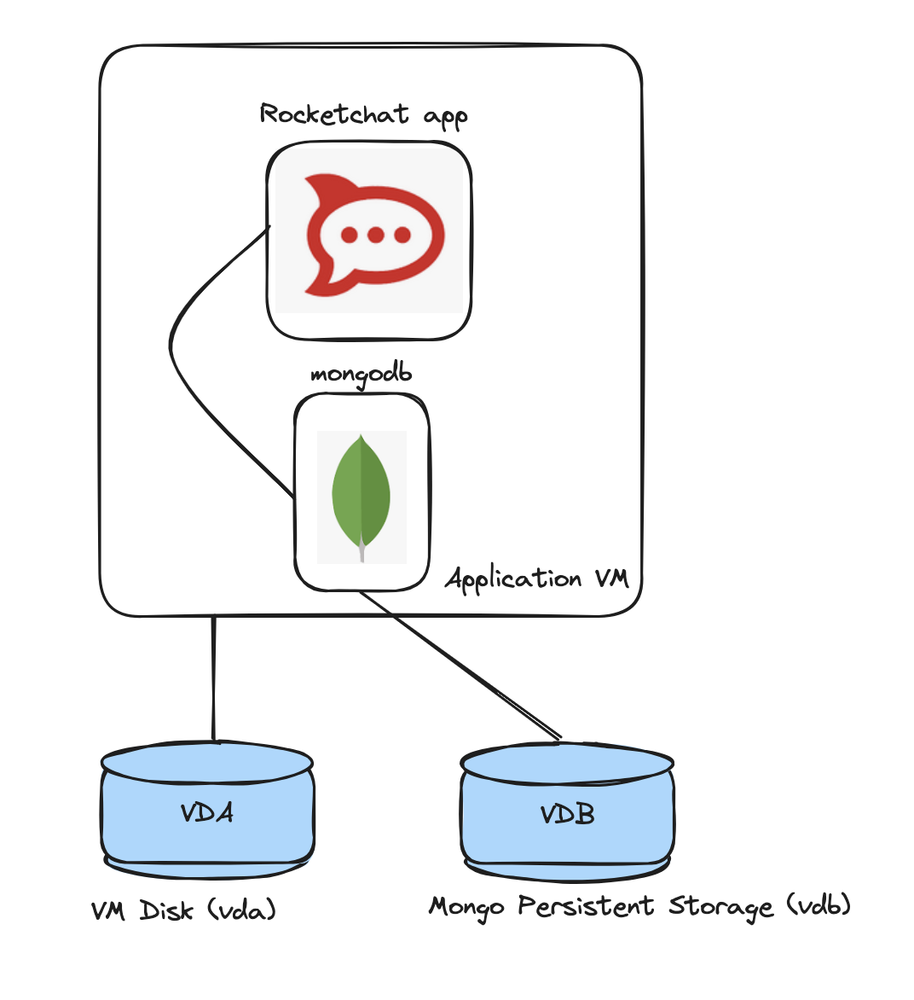
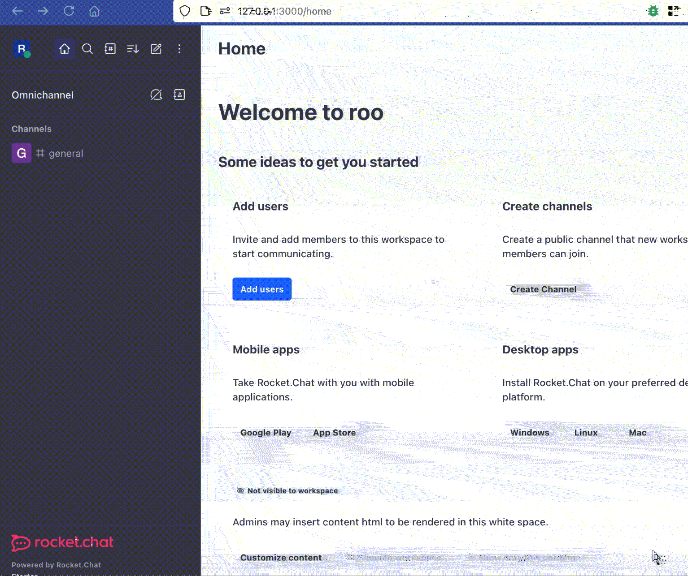
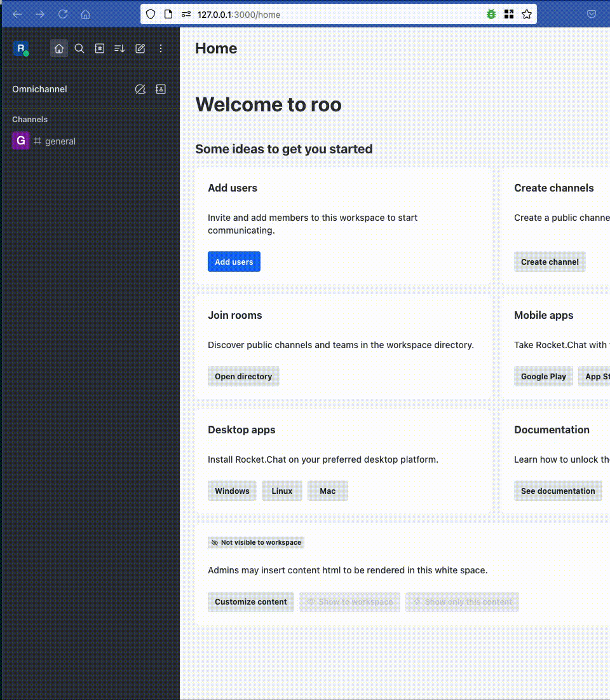
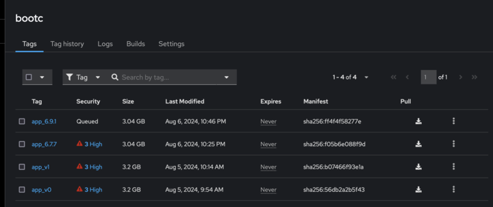

# RHEL Image Mode aka bifrost Demo

This demo shows 3 stages of bootc:
 - Build application from the source
 - Convert Container into QCOW and deploy it as a VM
 - Update application with newer version (patching/upgrade)

## Prereqs 

Any Linux host with installed libvirt and podman (assuming all other essentials utils like make or virt-tools are present)

## Setup 

 This code deploys Rocketchat application (Rocketchat + Mongodb) in a VM with additional qcow2 disk for mongo persistent storage.



## Quick install

1. Build QCOW image
```bash
make build-image
```

2. Run VM from built QCOW2
```bash 
make run-vm
```

3. Get node IP address
```bash 
make get-vm-ip
```

4. Login to <IP:3000>, register RocketChat account or login with existed account. Rocketchat is free for use onPrem with the registration.

5. Ensure version number


5. Update system with new image

check status of current image
```bash 
Red Hat Enterprise Linux 9.20240729.0.4 (Plow)
Kernel 5.14.0-427.26.1.el9_4.x86_64 on an x86_64

enp1s0: 192.168.122.156 fe80::f707:a1c4:dfaf:62ad
localhost login: user
Password: user
[user@localhost ~]$ sudo bootc status
apiVersion: org.containers.bootc/v1alpha1
kind: BootcHost
metadata:
  name: host
spec:
  image:
    image: quay.io/mancubus77/bootc:app_6.7.7
    transport: registry
  bootOrder: default
status:
...
```

update the image with new tag
```bash
user@localhost ~]$ sudo bootc switch quay.io/mancubus77/bootc:app_6.9.1
layers already present: 0; layers needed: 84 (3.0 GB)
...
```

reboot

check status of the new image and application



Application upgraded with newer version and persitent data remained


## Detailed process
  
There are few additional steps in the Makefile you might be using
 
`build-registry` - Build local container registry
`build-base` - Build base RHEL image (needs subscribed RHEL instances with entitlements)
`push-base` - Push base image to the registry
`build-app` - Build Rocket Chat application
`push-app` - Push app image to the registry
`build-image` - Build QCOW2/AMI image for VM/Baremetal deployment
`run-vm` - Run VM with RocketChat app (incl persistent storage)
`rm-vm` - Delete VM
`get-vm-ip` - Print VM's IP address


## Bonus

 Container files with VM image can be scanned by container security tools like Quay, and you may see ALL vurtnalabilies of your fleet without any extra scanning.

 